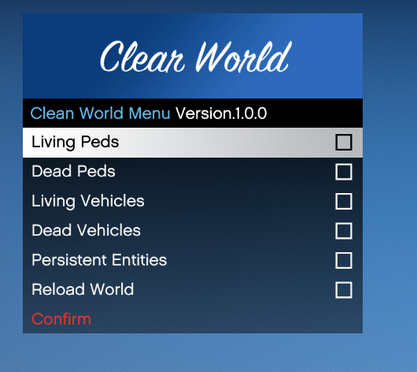
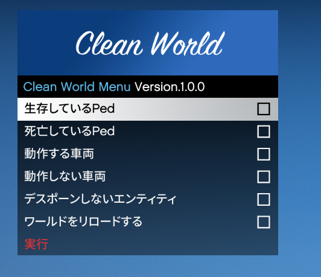

# Clean World Menu
## Features
- Simple and Easy to use
- Supporting many languages
- **Faster** than do "CleanWorld" in console

## Options
- Living Peds (y/n)
- Dead Peds (y/n)
- Living Vehicles (y/n)
- Dead Vehicles (y/n)
- Persistent Entities (y/n)
- Reload World (y/n)

## Showcase
### English

### Japanese

## Localization
You can translate this plugin in [Crowdin](https://crowdin.com/project/cleanworldmenu).

## Credits
[Newtonsoft.Json](https://www.newtonsoft.com/json) 
[RAGENativeUI](https://github.com/alexguirre/RAGENativeUI) 
[ScriptHookV .NET](https://github.com/scripthookvdotnet/scripthookvdotnet)